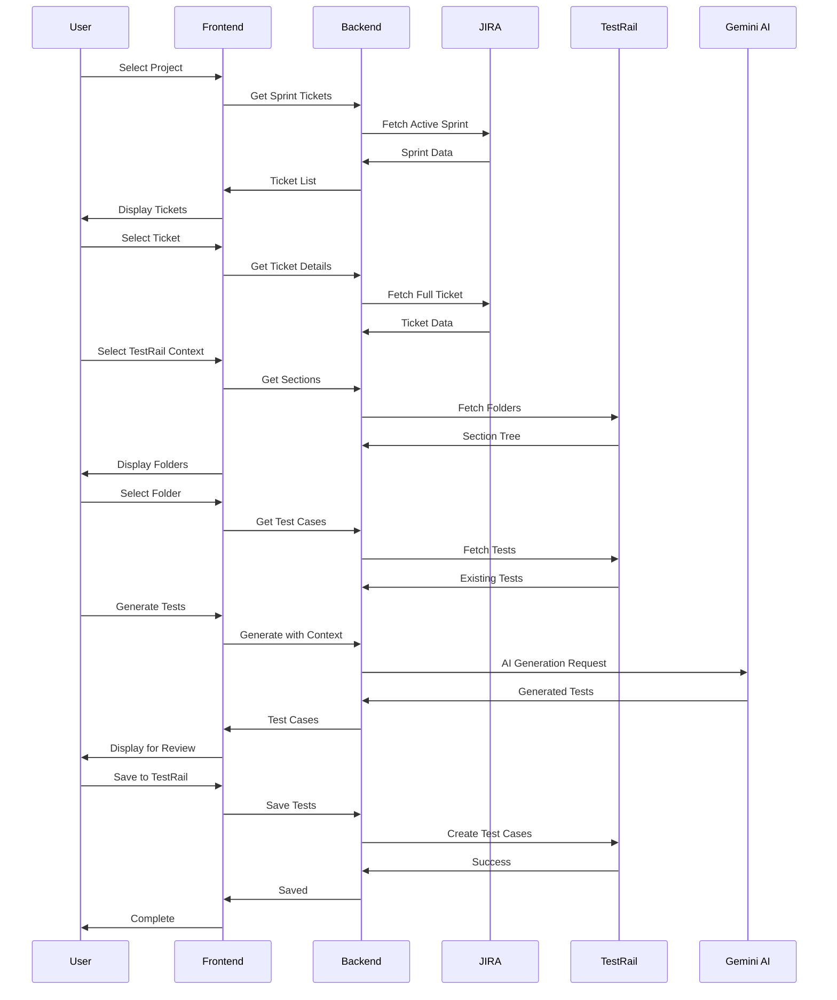

# QA Copilot - Current System Architecture

## Overview
QA Copilot is an AI-powered test generation platform that streamlines the QA process by automatically generating manual test cases from JIRA tickets, leveraging existing TestRail test patterns, and optionally converting them to automated Cypress tests.

## System Architecture

### High-Level Architecture
```
┌─────────────┐     ┌──────────────┐     ┌─────────────┐
│    JIRA     │────▶│  QA Copilot  │────▶│  TestRail   │
│   (Source)  │     │   Platform   │     │  (Storage)  │
└─────────────┘     └──────────────┘     └─────────────┘
                            │
                            ▼
                     ┌─────────────┐
                     │  Gemini AI   │
                     │ (Generation) │
                     └─────────────┘
```

## Core Components

### 1. Frontend (React + Vite)

#### Key Components
- **Dashboard** (`/frontend/src/pages/Dashboard.jsx`)
  - Project selection with search
  - Sprint overview with active tickets
  - Quick workflow launch

- **WorkflowWizard** (`/frontend/src/components/WorkflowWizard.jsx`)
  - Multi-step workflow management
  - Progress tracking
  - State persistence with localStorage

- **Workflow Steps**:
  - `TicketSelector` - Browse and select JIRA tickets
  - `ContextSelector` - Navigate TestRail folders and select context
  - `TestGenerator` - Configure and trigger test generation
  - `TestReviewer` - Review and edit generated tests
  - `TestRailSaver` - Save tests to TestRail
  - `CypressConverter` - Optional Cypress code generation

#### State Management
- React Query for server state
- Local state for UI components
- localStorage for workflow persistence

### 2. Backend (Node.js + Express)

#### Core Services

##### JiraService (`/backend/src/services/jiraService.js`)
**Purpose**: Interface with Atlassian JIRA API

**Key Methods**:
- `getBoards()` - Fetch all accessible projects
- `getCurrentSprint(boardId)` - Get active sprint
- `getSprintIssues(sprintId)` - Retrieve sprint tickets
- `getIssue(issueKey)` - Get detailed ticket information

**Authentication**:
```javascript
// Uses environment variables from ~/.zshrc
ATLASSIAN_URL=https://paramount.atlassian.net
ATLASSIAN_EMAIL=user@company.com
ATLASSIAN_TOKEN=xxx
```

**Board Mappings**:
```javascript
{
  'ESR': 3860,    // BETplus Roku
  'ESW': 2892,    // BETplus Web  
  'ESWCTV': 3859  // BETplus WCTV
}
```

##### TestRailService (`/backend/src/services/testRailService.js`)
**Purpose**: Interface with TestRail API

**Key Methods**:
- `getProjects()` - List all projects
- `getSuites(projectId)` - Get test suites
- `getSections(projectId, suiteId)` - Browse folder structure
- `getTestCases(projectId, suiteId, sectionId)` - Fetch existing tests
- `createTestCase(testData)` - Save new test

**Authentication**:
```javascript
TESTRAIL_URL=https://paramount.testrail.io
TESTRAIL_EMAIL=user@company.com
TESTRAIL_TOKEN=xxx
```

##### GeminiService (`/backend/src/services/geminiService.js`)
**Purpose**: AI test generation using Google Gemini

**Key Methods**:
- `generateTestCases(ticket, options)` - Main generation endpoint
- `parseTestCases(aiResponse)` - Parse AI response
- `generateMockTestCases()` - Fallback when API unavailable

**Configuration**:
```javascript
GOOGLE_API_KEY=xxx
GEMINI_MODEL=gemini-2.5-pro
```

**Generation Features**:
- Pattern learning from TestRail context
- Multiple test types (positive, negative, edge cases)
- Platform-specific test generation
- BDD and traditional format support

##### WorkflowOrchestrator (`/backend/src/services/workflowOrchestrator.js`)
**Purpose**: Manage multi-step workflow state

**Key Methods**:
- `startWorkflow(userId)` - Initialize new workflow
- `selectTicket(workflowId, ticket)` - Step 1
- `selectContext(workflowId, context)` - Step 2  
- `generateTests(workflowId, options)` - Step 3
- `reviewTests(workflowId, tests)` - Step 4
- `saveToTestRail(workflowId, data)` - Step 5
- `generateCypress(workflowId, tests)` - Step 6 (optional)

**State Management**:
```javascript
// In-memory workflow storage
workflows = new Map({
  'workflow_id': {
    userId: 'demo-user',
    startedAt: Date,
    currentStep: 3,
    steps: [
      { name: 'selectTicket', status: 'completed', data: {...} },
      { name: 'selectContext', status: 'completed', data: {...} },
      { name: 'generateTests', status: 'in_progress', data: null }
    ]
  }
})
```

### 3. Database (SQLite + Sequelize)

#### Models
- **TestCase** - Store generated test cases
- **Sprint** - Cache sprint information
- **PatternLearning** - Store learned test patterns

### 4. Additional Services

#### ConfluenceService
- Fetch additional documentation
- Extract test scenarios from Confluence pages
- Parse acceptance criteria

#### PatternLearningService  
- Analyze TestRail patterns
- Store common test structures
- Improve generation quality over time

#### CypressGenerator
- Convert manual tests to Cypress code
- Generate Page Object patterns
- Create executable test suites

## Data Flow

### Complete Workflow Sequence


## API Endpoints

### JIRA Endpoints
```
GET  /api/jira/boards                 - List all projects
GET  /api/jira/current-sprint/:boardId - Get active sprint
GET  /api/jira/sprint/:sprintId/issues - Get sprint tickets
GET  /api/jira/issue/:issueKey        - Get ticket details
GET  /api/jira/project/:projectKey/issues - Get recent issues
```

### TestRail Endpoints
```
GET  /api/testrail/projects            - List projects
GET  /api/testrail/suites/:projectId   - Get suites
GET  /api/testrail/sections/:projectId/:suiteId - Get sections
GET  /api/testrail/test-cases/:projectId/:suiteId - Get tests
POST /api/testrail/test-case           - Create test
```

### Workflow Endpoints
```
POST /api/workflow/start               - Start new workflow
POST /api/workflow/:workflowId/step    - Execute workflow step
GET  /api/workflow/:workflowId         - Get workflow status
```

### Gemini Endpoints
```
POST /api/gemini/generate              - Generate test cases
POST /api/gemini/set-model             - Switch AI model
GET  /api/gemini/current-model         - Get current model
```

## Configuration

### Environment Variables
```bash
# JIRA Configuration
ATLASSIAN_URL=https://paramount.atlassian.net
ATLASSIAN_EMAIL=svc-unified_chatbot@paramount.com
ATLASSIAN_TOKEN=xxx

# TestRail Configuration  
TESTRAIL_URL=https://paramount.testrail.io
TESTRAIL_EMAIL=svc-unified_chatbot@paramount.com
TESTRAIL_TOKEN=xxx

# Gemini AI Configuration
GOOGLE_API_KEY=xxx
GEMINI_MODEL=gemini-2.5-pro

# GitHub Configuration (Optional)
GITHUB_TOKEN=xxx

# Confluence Configuration (Optional)
CONFLUENCE_URL=https://confluence.paramount.tech
CONFLUENCE_EMAIL=xxx
CONFLUENCE_TOKEN=xxx
```

## Key Features

### 1. Smart Context Learning
- Analyzes existing TestRail tests
- Learns team's testing patterns
- Applies patterns to new tests

### 2. Multi-Platform Support
- Generates platform-specific tests (Web, Roku, CTV, Mobile)
- Adapts test steps for each platform
- Maintains consistency across platforms

### 3. Flexible Test Formats
- Traditional test case format
- BDD/Gherkin format
- Custom TestRail fields support

### 4. Quality Scoring
- Rates generated test quality
- Considers coverage completeness
- Validates against patterns

### 5. Workflow Persistence
- Saves progress in localStorage
- Recovers from interruptions
- Supports resume/restart

## Security Considerations

1. **API Authentication**
   - All credentials in environment variables
   - No hardcoded secrets
   - Token-based authentication

2. **Data Privacy**
   - No sensitive data in localStorage
   - Secure API communication
   - User-specific workflow isolation

3. **Error Handling**
   - Graceful fallbacks
   - No credential exposure in logs
   - Sanitized error messages

## Performance Optimizations

1. **Caching**
   - NodeCache for API responses (5-minute TTL)
   - Frontend query caching with React Query
   - localStorage for workflow state

2. **Lazy Loading**
   - Load test cases on demand
   - Paginated TestRail sections
   - Progressive workflow steps

3. **Batch Operations**
   - Bulk test creation in TestRail
   - Parallel API calls where possible
   - Optimized database queries

## Monitoring & Logging

### Logging Levels
- **INFO**: Normal operations
- **WARN**: Fallback scenarios
- **ERROR**: Operation failures

### Key Metrics
- API response times
- Test generation success rate
- Workflow completion rate
- Error frequency

## Deployment

### Development
```bash
# Backend
cd backend
npm run dev  # Runs with nodemon

# Frontend
cd frontend
npm run dev  # Runs with Vite
```

### Production Build
```bash
# Frontend build
cd frontend
npm run build

# Backend start
cd backend
npm start
```

### Docker Support
```dockerfile
# Multi-stage build for optimization
FROM node:18-alpine AS builder
# ... build steps

FROM node:18-alpine
# ... runtime configuration
```

## Testing Strategy

### Unit Tests
- Service layer testing
- Component testing
- Utility function tests

### Integration Tests
- API endpoint testing
- Service integration
- Workflow testing

### E2E Tests
- Complete workflow scenarios
- Cross-browser testing
- Platform-specific tests

## Maintenance & Support

### Common Issues
1. **API Rate Limits**: Implement exponential backoff
2. **Token Expiration**: Refresh mechanism needed
3. **Large Test Suites**: Pagination required

### Debugging Tools
- Browser DevTools for frontend
- Node.js inspector for backend
- API request logging

### Health Checks
```
GET /health - System status
{
  "status": "ok",
  "services": {
    "jira": true,
    "testRail": true,
    "gemini": true,
    "database": true
  }
}
```

## Future Enhancements

### Short Term
- User authentication system
- Team collaboration features
- Test execution tracking
- Advanced search capabilities

### Long Term
- ML-based test improvement
- Automated test maintenance
- CI/CD integration
- Multi-language support
- Custom AI model training

## Conclusion

The current QA Copilot system provides a robust foundation for AI-powered test generation, successfully integrating with enterprise tools (JIRA, TestRail) while leveraging state-of-the-art AI (Gemini) for intelligent test creation. The modular architecture allows for easy extension, as demonstrated by the planned Java-Selenium generation feature.