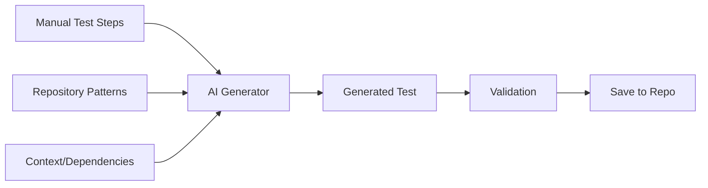

# QA Copilot Architecture: Manual & Automated Test Generation

## Overview
This document describes the complete architecture of QA Copilot, covering both the existing manual test generation system and the new Java-Selenium automated test generation capabilities.

## Current System Architecture (Manual Test Generation)

### Core Components

#### 1. JIRA Integration
- **Service**: `JiraService` - Connects to Atlassian JIRA
- **Authentication**: Basic Auth with API tokens from environment variables
- **Features**:
  - Fetch sprint tickets
  - Retrieve ticket details, acceptance criteria
  - Board-specific ticket mapping (ESW: 2892, ESWCTV: 3859, ESR: 3860)

#### 2. TestRail Integration  
- **Service**: `TestRailService` - Connects to TestRail API
- **Authentication**: API token authentication
- **Features**:
  - Browse test suites and sections (folders)
  - Fetch existing test cases for context
  - Save generated tests to TestRail
  - Support for custom fields and test steps

#### 3. AI Test Generation (Gemini)
- **Service**: `GeminiService` - Google Gemini AI integration
- **Model**: gemini-2.5-pro
- **Features**:
  - Generate test cases from JIRA tickets
  - Learn from TestRail context
  - Pattern-based test generation
  - Support for BDD and traditional test formats

#### 4. Workflow Orchestrator
- **Service**: `WorkflowOrchestrator` - Manages multi-step workflow
- **State Management**: In-memory workflow tracking
- **Steps**:
  1. Select Ticket
  2. Select TestRail Context  
  3. Generate Tests
  4. Review Tests
  5. Save to TestRail
  6. (Optional) Generate Cypress Tests

### Current Data Flow
```
JIRA Ticket → TestRail Context → Gemini AI → Generated Tests → TestRail Storage
```

## Enhanced Architecture (Advanced Test Generation)

### Current Implementation Status
**Completed Features:**
- ✅ Local repository support with validation
- ✅ Advanced AST-based pattern learning
- ✅ Multi-framework support (Selenium, Playwright, Rest Assured)
- ✅ Self-healing test capabilities
- ✅ API test generation from OpenAPI specs
- ✅ Git branch creation and IDE integration
- ✅ Pattern caching with 24-hour TTL
- ✅ Syntax-highlighted code preview

**Advanced Features Added:**
- ✅ Abstract Syntax Tree (AST) parsing for deep code understanding
- ✅ Semantic pattern recognition beyond regex
- ✅ Intelligent selector fallback strategies
- ✅ Security and performance test generation
- ✅ Contract testing with schema validation
- ✅ Test organization by type and endpoint

**In Progress:**
- ⏳ Test execution validation during generation
- ⏳ Automated PR creation with descriptions
- ⏳ Real-time pattern learning feedback

## User Experience Flow

### Phase 1: Manual Test Generation (Existing)
1. **Select Project** → Sprint board loads with active tickets
2. **Select JIRA Ticket** → Retrieve requirements and acceptance criteria  
3. **Select TestRail Context** → Browse folders and select similar manual tests
4. **Generate Manual Tests** → AI creates test cases based on ticket and context
5. **Review & Edit** → User refines generated test cases
6. **Save to TestRail** → Tests stored in TestRail for future reference

### Phase 2: Automated Test Generation (New)
7. **Generate Automated Test** → New workflow step after TestRail save
8. **Repository Configuration**
   - User provides either:
     - Path to local repository (e.g., `~/IdeaProjects/selenium-tests`)
     - GitHub URL for cloning (e.g., `https://github.com/company/selenium-tests`)
   - System validates and indexes repository
9. **Test Directory Selection**
   - Display repository folder structure (similar to TestRail browser)
   - User navigates and selects test directory
   - System remembers selection but allows changes for different test types
10. **AI Training & Generation**
    - Analyze selected directory and all dependencies
    - Learn patterns: Page Objects, assertions, waits, test structure
    - Generate Java-Selenium test combining:
      - Manual test steps (the "what")
      - Existing code patterns (the "how")
11. **Review & Save**
    - Preview generated code with syntax highlighting
    - Save to local repository
    - Auto-create git branch
    - Open in IntelliJ IDEA

## Technical Architecture

### Repository Management

#### Dual-Mode Support
The system supports two scenarios:

**Scenario 1: Existing Local Repository (Primary Use Case)**
- QA engineer provides path to existing local repository
- System performs optional `git pull` to get latest changes
- Creates cache/index for fast AI analysis
- Saves generated tests directly to local repository
- Enables immediate testing/debugging in IDE

**Scenario 2: Clone from GitHub**
- User provides GitHub repository URL
- System clones to `~/.qa-copilot/repos/`
- Creates cache/index for analysis
- Provides options to download or copy generated tests

### Caching & Indexing Strategy

```
~/.qa-copilot/
├── cache/
│   ├── [repo-hash]/
│   │   ├── index.json          # File structure and metadata
│   │   ├── patterns.json       # Learned test patterns
│   │   ├── dependencies.json   # Class dependency graph
│   │   ├── ast/               # Parsed Java AST cache
│   │   └── embeddings/        # Vector embeddings for similarity search
│   └── [another-repo-hash]/
├── repos/                      # Cloned repositories (when needed)
└── config/
    └── workspace.json          # User preferences and settings
```

### Pattern Learning System

#### AST-Based Pattern Learning (NEW)

**What is AST (Abstract Syntax Tree)?**
An AST is a tree representation of the syntactic structure of source code. Instead of analyzing code as text with regex patterns, AST parsing understands the actual structure and meaning of the code.

**Example: Traditional Regex vs AST**
```javascript
// Original Code
describe('Login Test', () => {
  it('should login successfully', async () => {
    await page.goto('/login');
    await page.fill('#username', 'testuser');
    await page.click('button[type="submit"]');
  });
});

// Regex Approach (Limited Understanding):
// - Finds: "describe('Login Test'"
// - Finds: "it('should login"
// - Misses: relationship between describe and it, async nature, actual actions

// AST Approach (Deep Understanding):
{
  type: 'CallExpression',
  callee: { name: 'describe' },
  arguments: [
    { type: 'Literal', value: 'Login Test' },
    {
      type: 'ArrowFunctionExpression',
      body: {
        type: 'CallExpression',
        callee: { name: 'it' },
        arguments: [
          { type: 'Literal', value: 'should login successfully' },
          {
            type: 'ArrowFunctionExpression',
            async: true,
            body: [
              { type: 'AwaitExpression', argument: { /* page.goto details */ } },
              { type: 'AwaitExpression', argument: { /* page.fill details */ } },
              { type: 'AwaitExpression', argument: { /* page.click details */ } }
            ]
          }
        ]
      }
    }
  ]
}
```

**Benefits of AST Parsing:**
1. **Semantic Understanding**: Knows the difference between a string containing "describe" and an actual describe function call
2. **Structural Relationships**: Understands nesting, scope, and relationships between code elements
3. **Type Information**: Can identify variable types, function parameters, return values
4. **Accurate Refactoring**: Can safely modify code without breaking syntax
5. **Pattern Detection**: Identifies complex patterns like promise chains, async/await usage, error handling

#### Analysis Components
1. **AST-Based Test Structure Analyzer**
   - Parses test files into syntax trees using Babel (JavaScript/TypeScript) or java-parser (Java)
   - Identifies test framework constructs (describe, it, test, @Test annotations)
   - Extracts test hierarchies and relationships
   - Maps assertion patterns with context awareness

2. **Semantic Page Object Detector**
   - Analyzes class structures and method signatures
   - Understands inheritance chains and interfaces
   - Maps element locators with their usage context
   - Identifies action methods vs. verification methods

3. **Intelligent Pattern Extractor**
   - Recognizes design patterns (Page Object Model, Factory, Builder)
   - Extracts wait strategies and synchronization patterns
   - Identifies data-driven testing patterns
   - Maps error handling and retry logic

4. **Code Flow Analyzer**
   - Traces execution paths through the AST
   - Builds control flow graphs
   - Identifies common test workflows
   - Maps data dependencies between test steps

### AI Generation Pipeline



#### Generation Process
1. **Input Processing**
   - Parse manual test steps
   - Extract key actions and validations
   - Identify test data requirements

2. **Pattern Matching**
   - Find similar tests in repository
   - Identify relevant Page Objects
   - Match assertion patterns

3. **Code Generation**
   - Generate test method structure
   - Apply learned coding patterns
   - Include proper imports and annotations
   - Use existing utilities and helpers

4. **Validation**
   - Syntax validation
   - Import resolution
   - Pattern consistency check

## Implementation Details

### Backend Services

#### AdvancedPatternLearningService (NEW)
```javascript
class AdvancedPatternLearningService {
  // Parse JavaScript/TypeScript using Babel AST
  async parseJavaScriptAST(code) {
    const ast = parse(code, {
      sourceType: 'module',
      plugins: ['typescript', 'jsx', 'decorators-legacy']
    });
    // Returns structured patterns with semantic understanding
  }
  
  // Parse Java using java-parser
  async parseJavaAST(code) {
    const ast = javaParser.parse(code);
    // Extracts annotations, methods, assertions with context
  }
  
  // Learn from entire repository
  async learnFromRepository(repoPath, options) {
    // Scans repository, builds AST for each file
    // Analyzes patterns across files
    // Creates pattern model with relationships
  }
  
  // Generate tests with self-healing capabilities
  async generateEnhancedTest(ticket, framework, patterns) {
    // Creates robust tests with fallback selectors
    // Includes retry logic and wait strategies
  }
}
```

#### PlaywrightTestGenerationService (NEW)
```javascript
class PlaywrightTestGenerationService {
  // Repository validation
  async validateRepository(path) {
    // Checks for package.json, playwright.config
    // Detects existing Playwright setup
    // Returns configuration recommendations
  }
  
  // Pattern learning with progress tracking
  async learnPatterns(projectPath, testDirectory) {
    // Stream progress updates to frontend
    // Analyzes existing Playwright tests
    // Extracts page objects, fixtures, helpers
  }
  
  // Generate Playwright tests
  async generateTests(ticket, reviewedTests, config, patterns) {
    // Creates TypeScript/JavaScript tests
    // Includes network mocking if enabled
    // Adds tracing and screenshots
    // Generates Page Object Model if requested
  }
  
  // Save with Git integration
  async saveTests(tests, config, ticket) {
    // Creates feature branch
    // Saves test files
    // Updates playwright.config.ts
    // Opens in VS Code/IDE
  }
}
```

#### ApiTestGenerationService (NEW)
```javascript
class ApiTestGenerationService {
  // Parse OpenAPI/Swagger specs
  parseOpenAPIEndpoints(spec) {
    // Extracts all endpoints with parameters
    // Identifies request/response schemas
    // Maps security requirements
  }
  
  // Generate comprehensive API tests
  async generateFromOpenAPI(spec, options) {
    // Creates functional tests (happy path, negative, boundary)
    // Generates contract tests (schema validation)
    // Adds security tests (SQL injection, XSS, auth)
    // Includes performance tests (load, stress)
  }
  
  // Multi-framework support
  generateRestAssuredTest(endpoint, options) {
    // Java-based API testing
  }
  
  generatePlaywrightApiTest(endpoint, options) {
    // TypeScript API testing with Playwright
  }
  
  generateKarateFeature(endpoint, options) {
    // BDD-style API tests in Karate DSL
  }
  
  // Convert manual tests to API tests
  async generateFromManualTests(manualTests, options) {
    // Extracts API calls from manual steps
    // Generates automated API tests
    // Maintains test context and validations
  }
}

### Frontend Components

#### RepositorySelector
- Radio buttons for local vs GitHub
- Path input with folder browser
- GitHub URL input with validation
- Pull latest changes checkbox

#### TestDirectoryBrowser
- Tree view of repository structure
- Filter for test directories
- Multi-select for multiple contexts
- Remember last selection

#### GeneratedTestReview
- Syntax-highlighted code preview
- Edit capability
- Save options (local, download, clipboard)
- IDE integration buttons

### IDE Integration

#### IntelliJ IDEA Support
```javascript
// Open generated test in IntelliJ
async function openInIntelliJ(filePath) {
  const platform = process.platform;
  
  if (platform === 'darwin') {
    // macOS
    await exec(`open -a "IntelliJ IDEA" ${filePath}`);
  } else if (platform === 'win32') {
    // Windows
    await exec(`idea64.exe ${filePath}`);
  } else {
    // Linux
    await exec(`idea ${filePath}`);
  }
}
```

## Storage & Persistence

### Workspace Configuration
```json
{
  "defaultWorkspace": "~/qa-copilot-workspace",
  "repositories": {
    "selenium-tests": {
      "type": "local",
      "path": "~/IdeaProjects/selenium-tests",
      "lastUsed": "2024-01-15T10:30:00Z",
      "defaultTestDir": "/src/test/java/com/company/tests/",
      "cachedAt": "2024-01-15T10:00:00Z"
    }
  },
  "preferences": {
    "autoOpenInIDE": true,
    "createGitBranch": true,
    "pullBeforeGenerate": true,
    "cacheExpiration": "24h"
  }
}
```

### Generated Test Tracking
```json
{
  "generatedTests": [
    {
      "ticketId": "ESWCTV-874",
      "testFile": "SkipIntroTest.java",
      "repository": "selenium-tests",
      "path": "/src/test/java/com/company/tests/video/",
      "generatedAt": "2024-01-15T11:00:00Z",
      "gitBranch": "qa-copilot/ESWCTV-874"
    }
  ]
}
```

## Performance Considerations

### Caching Strategy
- **Initial Index**: One-time cost (7-8 seconds for 52MB repo)
- **Cache TTL**: 24 hours by default
- **Incremental Updates**: Only re-index changed files
- **Pattern Cache**: Reuse learned patterns across sessions

### Optimization Techniques
1. **Parallel Processing**
   - Clone and index in parallel
   - Analyze multiple files concurrently

2. **Smart Indexing**
   - Index only `.java` files
   - Skip test resources and compiled code
   - Focus on test directories

3. **Lazy Loading**
   - Load file contents only when needed
   - Cache frequently accessed patterns

## Security Considerations

1. **Repository Access**
   - Support GitHub personal access tokens
   - Handle private repositories
   - Respect `.gitignore` patterns

2. **Local Storage**
   - Encrypt cached credentials
   - Secure workspace permissions
   - Clean sensitive data from cache

3. **Generated Code**
   - Sanitize inputs
   - Validate generated imports
   - Prevent code injection

## AST Parsing Deep Dive

### Understanding Abstract Syntax Trees

AST parsing is a fundamental technique in compiler design and code analysis that transforms source code into a tree structure representing its syntactic structure. This is crucial for our advanced pattern learning.

#### How AST Parsing Works

1. **Lexical Analysis (Tokenization)**
   ```javascript
   // Source code
   const result = await page.click('#submit');
   
   // Tokens
   [CONST] [IDENTIFIER:result] [EQUALS] [AWAIT] [IDENTIFIER:page] [DOT] 
   [IDENTIFIER:click] [LPAREN] [STRING:'#submit'] [RPAREN] [SEMICOLON]
   ```

2. **Syntactic Analysis (Parsing)**
   ```javascript
   // AST Structure
   {
     type: 'VariableDeclaration',
     kind: 'const',
     declarations: [{
       type: 'VariableDeclarator',
       id: { type: 'Identifier', name: 'result' },
       init: {
         type: 'AwaitExpression',
         argument: {
           type: 'CallExpression',
           callee: {
             type: 'MemberExpression',
             object: { type: 'Identifier', name: 'page' },
             property: { type: 'Identifier', name: 'click' }
           },
           arguments: [
             { type: 'Literal', value: '#submit' }
           ]
         }
       }
     }]
   }
   ```

3. **Pattern Extraction**
   - Traverse the AST to find patterns
   - Extract semantic information (async calls, selectors, assertions)
   - Build pattern database with context

#### Real-World Example: Learning Test Patterns

**Input Test File:**
```javascript
describe('User Registration', () => {
  beforeEach(async () => {
    await page.goto('/register');
  });

  it('should register with valid data', async () => {
    await page.fill('#email', 'test@example.com');
    await page.fill('#password', 'SecurePass123');
    await page.click('button[type="submit"]');
    
    await expect(page.locator('.success-message')).toBeVisible();
    await expect(page).toHaveURL('/dashboard');
  });
});
```

**AST Analysis Results:**
```javascript
{
  patterns: {
    testStructure: {
      framework: 'playwright',
      style: 'BDD',
      hasSetup: true,
      setupType: 'beforeEach',
      async: true
    },
    selectors: {
      strategy: 'mixed', // Uses both ID and CSS selectors
      types: [
        { type: 'id', examples: ['#email', '#password'] },
        { type: 'css', examples: ['button[type="submit"]', '.success-message'] }
      ]
    },
    actions: [
      { method: 'goto', usage: 'navigation' },
      { method: 'fill', usage: 'input', count: 2 },
      { method: 'click', usage: 'interaction' }
    ],
    assertions: [
      { method: 'toBeVisible', target: 'element' },
      { method: 'toHaveURL', target: 'page' }
    ],
    waitStrategies: {
      implicit: false,
      explicit: true,
      method: 'expect with auto-wait'
    }
  }
}
```

#### Advantages Over Regex Pattern Matching

| Aspect | Regex Approach | AST Approach |
|--------|---------------|--------------|
| **Accuracy** | Can match strings in comments | Only matches actual code constructs |
| **Context** | No understanding of scope | Knows variable scope and relationships |
| **Refactoring** | Risk of breaking code | Safe code modifications |
| **Complexity** | Struggles with nested structures | Handles any level of nesting |
| **Maintenance** | Fragile, breaks with formatting | Formatting-independent |
| **Performance** | Fast for simple patterns | Better for complex analysis |

#### Tools We Use for AST Parsing

1. **JavaScript/TypeScript**: `@babel/parser`
   - Supports modern JS features
   - TypeScript support via plugins
   - JSX parsing capability

2. **Java**: `java-parser`
   - Full Java language support
   - Annotation processing
   - Generic type handling

3. **Python**: `ast` module (future)
   - Built-in Python library
   - Full Python syntax support

#### How This Powers Our Test Generation

1. **Pattern Learning**
   - Analyzes existing test repository
   - Builds comprehensive pattern database
   - Learns team-specific conventions

2. **Code Generation**
   - Generates syntactically correct code
   - Maintains consistent style
   - Applies learned patterns accurately

3. **Self-Healing Tests**
   - Identifies selector patterns
   - Generates fallback strategies
   - Creates robust element locators

4. **Framework Detection**
   - Automatically identifies test framework
   - Adapts generation to framework conventions
   - Maintains framework-specific best practices

## Future Enhancements

### Phase 1 (MVP)
- Basic repository cloning and indexing
- Simple pattern learning
- Generate basic Selenium tests
- Local repository support

### Phase 2
- Advanced pattern learning with ML
- Support for multiple test frameworks (TestNG, JUnit 5)
- Cucumber/BDD test generation
- Git branch creation and PR automation

### Phase 3
- CI/CD integration
- Test execution from UI
- Test results tracking
- Multiple language support (Python, JavaScript)

### Phase 4
- AI-powered test maintenance
- Auto-update tests when UI changes
- Test coverage recommendations
- Performance optimization suggestions

## Conclusion

This architecture provides a robust foundation for generating high-quality Java-Selenium tests by learning from existing test patterns. The dual-mode repository support accommodates both engineers with local repos and those needing to clone, while the intelligent caching ensures fast performance after initial setup.

The system maintains code consistency, reduces manual effort, and accelerates test automation development while preserving the team's coding standards and practices.